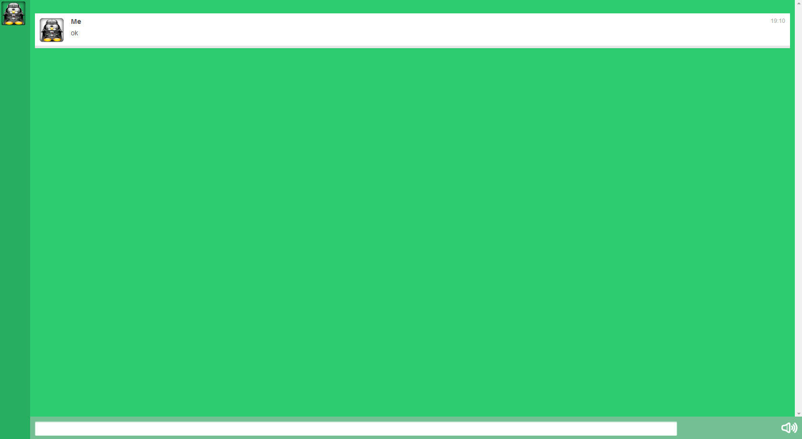

#ChatC-Web

[](http://gruntjs.com/)

A chat with Socket.io and Node.js !

It's my first realy application with Node.js !

It's a simple chat.

This chat will be upgrade soon.

Before launch:

```bash
$ npm install
```

To launch:

```bash
$ node server.js
```

To minify:

```bash
$ grunt
```


